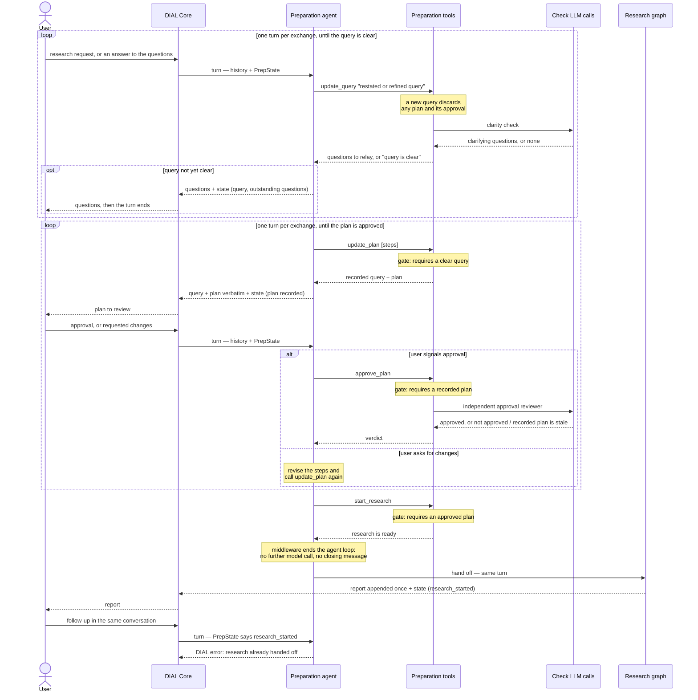
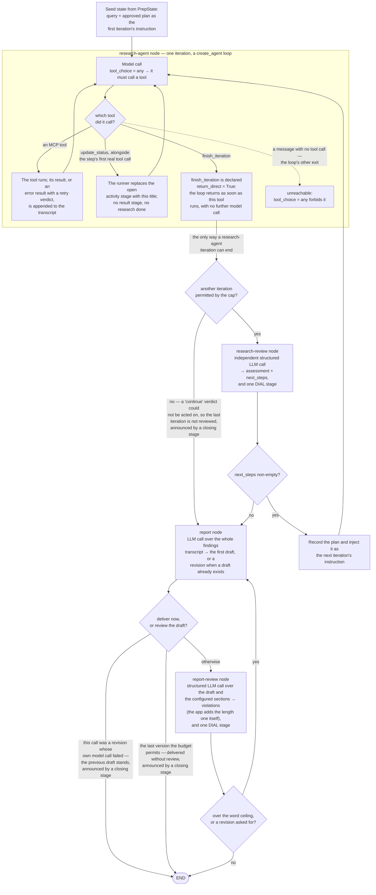

# How Deep Research works

Diagrams of the current runtime flow: the preparation flow, which spans several turns, and the
research graph, which runs autonomously inside one turn. **Turn** here means a DIAL turn between
the user and the assistant: one chat completion request carrying the user's new message, and the
assistant reply streamed back for it. The app keeps nothing between turns, rebuilding each one from
the request it arrives in.

The [OpenSpec specs](../openspec/specs) are the authority on the behaviour. This page is a map:
each section links the specs that own its requirements and quotes only short excerpts from them, so
when a spec changes the diagram points at the new wording instead of restating stale rules.

- [Preparation flow](#preparation-flow)
- [Research graph](#research-graph)

## Preparation flow

Specs: [clarification-and-plan-alignment](../openspec/specs/clarification-and-plan-alignment/spec.md).
Code: `app/preparation/`, `app/completion.py`, `app/history.py`.

The preparation agent advances a clarify → plan → approve → launch flow by calling tools, and the
ordering is enforced by the tools, not by the agent:

> The flow's ordering SHALL be enforced by tool preconditions (hard gates), not by the agent's
> discretion: research SHALL NOT be startable until the working query's clarifications are resolved
> and the plan is user-approved.

Two of the tools make their own independent structured LLM calls — the clarity check inside
`update_query`, and the approval reviewer inside `approve_plan`. The agent cannot approve its own
plan, nor write the readiness flags: only tool code mutates `PrepState`.

Turns are stateless. Each turn reconstructs the history and `PrepState` from the request and
persists both back into the assistant message's `custom_content.state`; the same property is what
makes a rewind work with no rewind-detection logic.

The final turn is where preparation hands off: `start_research` fires and research runs in the
**same** turn, so preparation and research are persisted together, once, at the end of it
(`app/completion.py`). A later message on the same conversation is refused — see the
research-already-handed-off scenario in
[dial-agent-with-mcp](../openspec/specs/dial-agent-with-mcp/spec.md).

The hand-off is silent, and by control flow rather than by prompt wording: a `before_model`
middleware ends the preparation agent's loop as soon as `PrepState` says research has started, so
no model call follows the gate and nothing announces that research is starting. One case stays
outside that guarantee, knowingly: text the model wrote on the same assistant message that carries
the `start_research` call was already streamed before the tool ran, and DIAL content cannot be
retracted, so such a sentence can still appear ahead of the report.

## Research graph

Specs: [research-execution](../openspec/specs/research-execution/spec.md),
[report-composition](../openspec/specs/report-composition/spec.md) (what the report must look like
and the loop that enforces it),
[report-citations](../openspec/specs/report-citations/spec.md) (what the delivery step does to the
settled draft),
[dial-agent-with-mcp](../openspec/specs/dial-agent-with-mcp/spec.md) (the research-agent node, MCP
tool loading, stages, error delivery).
Code: `app/research/`.

A deterministic LangGraph with four nodes, where every phase transition is Python over the state,
never a model decision:

> `START → research-agent → (research-review when another iteration may still run, else report —
> the last permitted iteration's findings are not reviewed) → (research-agent when
> research-review returns a non-empty next plan, else report) → (END when this call was a
> revision whose own model call failed, or when the draft is the last version the budget
> permits — it is delivered without review — else report-review) → (report when the draft's
> measured word count exceeds the ceiling or report-review asks for a revision, else END)`

**A research-agent iteration ends only when `finish_iteration` is called.** Two mechanisms give
that guarantee, and together they mean research-agent cannot stop early, cannot write its own
summary, and cannot reach the report without a research-review verdict:

- **Forced tool choice** — every model call is issued with `tool_choice="any"`, so each step calls
  some tool. A message carrying no tool call is what would normally end a `create_agent` loop, so
  that exit is unreachable.
- **`return_direct=True` on `finish_iteration`** — the loop returns as soon as that tool executes,
  with no further model call. The tool is a no-op signal: it ends the iteration and nothing more,
  leaving review-vs-report to the graph.

The spec sentence that owns the rule:

> A research-agent iteration SHALL therefore end **only** when research-agent calls
> `finish_iteration`. That tool SHALL be declared `return_direct=True`, so the agent loop returns
> as soon as it executes, with no further model round-trip.

The rest of the loop, in brief — each item is specified in the linked specs:

- **Research-review**: an independent structured LLM call judging coverage; an empty next plan means
  research is complete. It runs after every iteration except the last one the cap permits — a
  "continue" verdict there could not be acted on, so that call is not made.
- **Iteration cap**: `max_research_iterations` (an application property). The last permitted
  iteration hands its findings straight to the report, unreviewed, so a turn always ends with a
  report; the hand-off is logged.
- **Report node**: the only node whose text becomes assistant content, and it is **appended once**,
  after the review loop settles on the draft to deliver. Nothing is streamed: a draft may still be
  revised and DIAL content is append-only, so no rejected draft ever reaches the user. The same node
  writes the first draft and every revision, branching on whether a draft already exists.
  Research-agent, research-review and report-review output never become assistant content;
  research-agent tool calls surface as timed DIAL stages. What reaches the user is that draft after
  the delivery step below, the one permitted transformation between the two.
- **Report delivery** (`ResearchRunner._deliver_report`, `app/research/citations.py`,
  `app/research/references.py`, `app/research/file_sharing.py`,
  `app/research/document_metadata.py`,
  `app/research/dataset_metadata.py`, `app/research/citation_lookups.py`): the citation step,
  run once per turn between the graph finishing
  and the report being appended. It makes three alterations to the settled draft, in this order:
  every hyperlink form goes (a link keeps its label, an image is dropped whole, an autolink or bare
  URL is deleted), then each convertible citation marker is replaced by an empty marker tag,
  `<cit data-id="…"></cit>`, then the References section is built and appended. Each kind of
  citation has its own condition, and each is about whether the reader can open what the pill points at: a `[doc <id>, page <ix>]` marker converts
  when the file-sharing tool returned a PDF URL for that document, a `[dataset <urn>]` marker
  converts when the dataset-metadata tool reported that URN with an absolute `http` or `https`
  URL, and a `[data_query <id>]` marker converts when the turn captured, for exactly that query
  id, a data explorer URL that is absolute `http` or `https` (see the data-query capture bullet
  below). Whether the query returned data is not part of that condition, and a query without a
  URL never falls back to its dataset's page. A marker whose condition fails keeps its text exactly
  as the writer wrote it. Markers
  standing next to each other, separated
  only by spaces, commas or semicolons, share one tag and render as one pill, a document and a
  dataset among them. The post-processed
  text is what is appended **and** what is persisted, so a later turn reads back what the user saw.
  One `custom_content.annotations` array follows the content, one entry per converted citation,
  each naming its tag's id. Every label is a leading part naming the source plus a fixed trailing
  part, the trailing part appended after any shortening: a document reads
  `<publication title>, page <ix>`, a dataset reads `<dataset name> dataset`, and a data query
  reads the same as the dataset it ran against, the name coming from the catalogue record of the
  query's structured `datasetUrn`. A lookup that
  resolved nothing changes only the leading part — `doc <id>` for a document, the URN for a
  dataset — so no label says which citations fell back. A data query that reported no dataset URN
  reads `data_query <id>`, unshortened. The pill's copy of the leading part is
  shortened to `max_pill_title_chars` where a channel sets it (null, the default, shows it whole),
  because the client does not trim an overflowing label; the card keeps it whole. One label that is never
  shortened is an unresolved document's, `doc <id>, page <ix>` being short by construction. A
  document annotation carries the cited page in a zero-size `pdf_bbox` selector, an
  `application/pdf` attachment type and no `body.quote`; a dataset annotation carries no selector,
  a `text/html` type — which is what makes the client's card offer "open in browser" rather than a
  download — and no `body.quote`, its card title going on to ` - last update <date>` when the
  catalogue reported one. A data-query annotation is a dataset one with the data explorer URL in
  place of the dataset's page and with a `body.quote`: one `* <dimension>: <value>, …` item per
  `in` filter, in display names, each cut to `data_query_card_filter_max_line_chars` (80 by
  default), then one `From … until …`, `From …` or `Until …` item from the requested period. Two
  citations of one query id are one source and two query ids are two, even on one dataset. The
  payload is dumped with `exclude_none=True`, so a field that does not
  apply is absent rather than null. No label carries a URL: a dataset's page is reached by
  clicking the pill and then the card's open-in-browser action, both of which belong to the client.
  The **References section is written by the app**, not by the report writer, from the metadata
  the same step already resolved — so its rows are a server's facts rather than a model's
  recollection. It carries a `##` heading with `references_section_name` and one `###` table per
  configured MCP server whose sources the report cites, in the order the servers are configured;
  a server with nothing cited contributes no table, and a report that cited nothing carries
  `references_section_empty_text` instead. Each table's sub-heading and its
  ordered columns come from `mcp_servers[].references_table`, each column a heading a reader sees
  and the metadata key or catalogue field it reads. Every cited source gets a row whether or not
  its metadata resolved and whether or not its citations became pills; the first column names the
  source and falls back to `doc <id>` or the URN when its key resolves nothing, while every other
  column is left blank, and nothing marks a row as degraded. The dataset table lists the datasets
  cited either way: a `[data_query <id>]` citation of a query with an explorer link counts as a
  citation of its dataset, at that marker's position, so a dataset cited both ways is one row at
  its first citation, and it opens the dataset's page. Such a query that reported no dataset URN
  gets a text row of its own reading `data_query <id>`; a query without an explorer link adds no
  row, so a data-query citation is either a pill with a row or text with neither. A cell renders
  a string as written, a number or boolean as its text and a list joined with `, `, escaping `|` and collapsing line
  breaks so a value cannot break the table. A row whose source can be opened — on the
  same condition its inline citations convert on — carries only a marker tag in its first cell, and
  an annotation of the row's own claims it, so the source's name is the pill. That annotation is an
  inline one's with two differences: both labels are the first cell's value alone, with no page and
  no `dataset` (shortened on the pill to `max_pill_title_chars` like any pill, except a `doc <id>`
  fallback), and a document row opens its document at page 1. Row annotations
  follow the inline ones in the same array, their indices continuing it. The row is opened through
  an annotation rather than a link because a cited document's shared URL is storage-relative, so an
  ordinary Markdown link to it opens nothing; nothing here writes a link, so the no-hyperlink rule
  needs no exemption. The
  section is appended and nothing is taken out of the draft: a draft that wrote its own references
  section is reported for the extra `##` heading while a version remains, and its words count
  toward the ceiling, but a draft that spends its last version still carrying one is delivered with
  that section followed by the app's. Removing it would mean removing a heading and everything
  below it, which takes whatever the writer put after it. The section is built for every delivered
  report; no configuration switches it off.
  The build is the last pass, so its failure costs the section and its row pills alone and is one
  WARNING (`kind=references_build_failed`); every pill the conversion earned is already in the
  text.
  The step's three resolutions are issued together in one `asyncio.gather`, each failing
  independently into an empty mapping, so the step costs one round trip. The
  document metadata comes from one MCP resource read per turn, at the URI named by
  `mcp_servers[].document_metadata_resource` with the cited ids substituted. It answers with each
  document's stored metadata whole; the label takes the value under
  `mcp_servers[].document_title_key` and a References row takes its configured columns out of the
  same answer, so a pill's title and its row's first cell are one fact rather than two lookups. A `generic_rag` server must name both, and the read asks about
  every cited document — which is what frees it from the file-sharing answer — while only the titles
  of documents that resolved a URL reach a label or the titled count. Its failures are graded one step
  below the file-sharing ones because a title costs a label rather than a link: naming no resource
  is DEBUG, a failed or unreadable read is one WARNING, and a document whose metadata simply
  carries no title is recorded only as the gap between the resolved and titled counts. The
  document URLs come from one call per turn to the tool named by `mcp_servers[].file_sharing_tool`,
  invoked tool-call-shaped so its structured result is reachable, and with the agent tools' error
  handling cleared so a failure reaches the app instead of arriving as result text. The dataset
  names, page addresses and last-update dates come from one successful call per turn to the tool
  named by `mcp_servers[].dataset_metadata_tool`, made with no arguments and answered with the
  channel's whole catalogue, from which the app selects the cited URNs — those of the dataset
  markers and those of the cited queries with an explorer link — by exact string match. The
  catalogue answer and the document metadata are read through one `CitationLookups` object per
  request, which the report review's identifier checks fill first, so the delivery asks only for
  what no check has looked up. A `statgpt`
  server must name that tool and only a `statgpt` server may, and it **stays in the research
  agent's tool list**, because a catalogue listing is how the agent discovers which datasets exist;
  its error handling therefore stays the agent's, and the reader takes a server error off the
  returned message's `status`. Each metadata surface is required of the server type whose citation
  ids it resolves, so a channel that resolves none of a kind is one that configures no server of
  that kind: it converts nothing of that kind and records the absence at DEBUG. Every other failure — a tool the
  server does not advertise, a failed call, an unreadable answer, an id the answer omitted, and a
  failure of the step's own passes — is one WARNING naming the kind, and none of them can fail the
  turn or withhold the report. A cited dataset the catalogue reports without a page URL is no
  failure at all, and reads only as the gap between the requested and resolved dataset counts.
  On a turn whose report cites a query id, the step also warns once when the turn captured no
  data-query record at all, once when cited ids match no captured record (not both), and once when
  tool results carried an unreadable payload; the (8c) event counts the query ids requested and
  those with an explorer link beside the dataset counts, which cover `[dataset <urn>]` markers
  only. Every record of the step carries counts and never a URL, a file name,
  a document title, a dataset name, a filter value, or a cited document's, dataset's or query's id.
- **Report structure**: `default_report_structure` (an application property) — an ordered list of
  `{name, description, protected}` sections, Overview → Key Findings → Detailed Analysis →
  Conclusion by default. Unknown fields are refused, so a stored entry still carrying the
  withdrawn `references_section` flag fails validation rather than becoming a section the writer is
  asked to write beside the app's own. Every section is rendered as a `##`
  heading, and the app checks that itself (see the rules bullet below). A section's `description`
  is the single home for its content rules and is passed verbatim to both the report node and
  report-review. A protected section (Overview, by default) may be neither dropped
  nor restyled by anything the user asked for; at least one section must be protected. Both models
  are told which sections are protected as a rule of their own — the marker is never rendered next
  to a section name, which the report node is told to use as the heading. The References section is
  no section of this list: the app appends it, so the structure both prompts are given is the
  configured structure entire. The writer is told not to write one, and report-review holds the
  same prohibition as one of its checks — so it reports a list the draft wrote and has no ground to
  demand one, whatever the question or the plan said. What both rules forbid is an **enumeration**,
  a list carrying one entry per source; describing the evidence in prose is not that, and a section
  whose description asks for it — the Overview names the kinds of source the research covered — is
  correct to do so.
- **Word ceiling**: `max_report_words` (default 2750). A report's length is the number of
  whitespace-separated tokens left after dropping the inline citations,
  so the ceiling bounds the report's prose rather than its sourcing — `count_report_words` in
  `app/research/report_length.py` is the one definition. The references section needs no
  exemption, being no part of a draft: the app appends it after the loop settles. A draft that
  writes one anyway is measured with it, so a structure violation earns no length budget. The
  count is computed in Python and given to the report node
  as a number, so no model has to count; report-review never sees the count — the app's own length
  rule adds the violation when the count exceeds the ceiling. The ceiling is enforced by
  rewriting, never by truncation: no token cap is placed on the report call, and a shortening
  revision rewrites to fit instead of cutting, so the report ends at a clean boundary. A draft over
  the ceiling forces a revision deterministically, even when report-review approved it.
- **App-checked rules** (`app/research/report_rules.py`): the report rules the app decides
  itself — over the draft text, the section structure (every configured section present, named
  exactly as configured, in order, as a `##` heading), the word ceiling, and the absence of
  hyperlinks (no Markdown link or image, no reference-style link or its definition line, no raw
  HTML anchor or image tag, no autolink, no bare URL); over the draft and what the turn learned,
  the cited identifiers. Every cited query id must be one the turn captured, of a query whose
  structured result carries a `seriesCount` above zero, the explorer link playing no part; the
  violation for an unknown id asks for the reported id, and the one for a query without data
  redirects a statement about the dataset to `[dataset <urn>]` and any other to dropping the
  citation or the statement. Every cited dataset URN must be in the catalogue, and every cited
  document id known to the document-metadata resource; the cited page is not checked, and an id
  whose lookup failed, or of a kind the channel has no server for, raises nothing. Report-review
  first awaits `CitationLookups.prefetch(draft)` concurrently with its model call, since the rules
  themselves are synchronous (the
  [report-composition](../openspec/specs/report-composition/spec.md) spec owns the checks'
  wording). Each rule owns three things in one class:
  the instruction rendered into the report writer's prompt, the check over the finished draft, and
  the wording of the violation a revision acts on, so the writer can never be told something
  different from what its draft is judged against. Their violations are prepended to
  report-review's own, and report-review is told the app checks all of them — leaving it what
  needs a reader: a padded section, the protected-section rules, the banned annotations, valid Markdown,
  the citation format. The hyperlink rule's violation asks for the **sentence** to be rewritten
  rather than for the URL to be deleted, because only the report writer can produce a sentence that
  still reads well without it; the delivery step's removal is the guarantee behind it, for a draft
  the review never got to revise. The detection is shared — the rule and the delivery step both
  call `citations.find_hyperlinks` — so the two cannot disagree about what a hyperlink is. Because the structure check passes only when every heading matches the
  configuration, a references section a draft wrote is always reported while a version remains.
- **Version budget**: `max_report_versions` (default 3) — at most that many report versions, the
  first draft included, so at most three report calls. The last permitted version is delivered as
  it stands, without another review call: its verdict could not be acted on. A failed
  report-review call or a failed revision is absorbed rather than failing the turn. `1` skips
  report-review entirely.
- **Research-review stage**: each research-review call emits one DIAL stage, titled
  `[RESEARCH REVIEW RESULT]`, carrying the reviewed iteration with the iteration cap, the
  reviewer's assessment, and the next steps as a numbered list — or a line stating that research is
  complete, which is what an empty step list means. Its title names the route the graph then takes,
  `continue` or `report`, taken from the same function the router calls. The assessment and the
  steps are LLM response text, so the matching INFO record carries the step *count* only. A failed
  review call emits no stage: research-review re-raises, so the turn ends and the open activity
  stage closes as failed. An iteration the cap left unreviewed is announced by a stage of its own,
  emitted by the router as it hands over so that it precedes the report's stages: it states that the
  review budget is exhausted and carries the iteration with the cap, without a duration — no call
  was made, so it has no findings and no elapsed time. A cap of one emits nothing — one permitted
  iteration means review is off by configuration, not exhausted, the same rule a version budget of
  one follows.
- **Report stage**: the report step emits one stage in a single case — a revision whose own model
  call failed, where the previous draft is delivered instead. It carries its own
  `[REPORT REVISION FAILED]` prefix, because a prefix names the step the stage speaks for and this
  one is the report step reporting on itself, and names the draft that was not written, the draft
  delivered, and the failure kind. No draft text: only the draft the loop settles on reaches the
  response.
- **Report-review stage**: each report-review call emits one DIAL stage, titled
  `[REPORT REVIEW RESULT]`, carrying the draft number,
  the measured word count with the ceiling, and the violations as a list — the review model's
  violations, with the app-measured length violation prepended when the draft exceeds the ceiling.
  The matching INFO record carries the same numbers and only the *count* of violations — their
  text is LLM response content, which the logging content allowlist keeps out of log records at
  any level. A delivery whose draft the budget left unreviewed gets a closing stage and INFO
  record of its own, rendered without any model call, so "review approved the draft" and "the
  budget ran out, violations may remain" stay distinguishable.
- **Activity stage**: one DIAL stage is open at every moment of the research run, titled with what
  is happening right now. The runner opens the first before the graph starts; each later one
  replaces the one before it, which is what closes it — a stage name can only be appended to, never
  rewritten. research-agent sets the title by calling `update_status`, and research-review, report
  and report-review each set it on entry, so no LLM call in the graph runs behind a silent screen.
  The citation step replaces it once more after the graph finishes, and closes it before the report
  text is appended, so the content never arrives under an open stage; that step opens a stage only
  once it has work — a file-sharing call to make, or an edit to apply — because a draft citing
  nothing and carrying no link would otherwise open and close one in the same instant.
  The stage carries a title only: no body, no `[TOOL]`-style prefix, and no elapsed time — it ends
  because a new step started, not because the announced work finished, so a duration would claim
  something untrue. Several statuses in one assistant message are joined into one title rather than
  opening a stage that closes an instant later and so reads as a finished step; a status sent
  together with `finish_iteration` is ignored. `update_status` gets no result stage of its own and
  no INFO tool-call event, and its text never enters a log record, being a tool-call argument value.
  The announcements are stripped from the transcripts research-review and the report node receive,
  and kept in the one the app persists.
- **Step budget**: `max_research_graph_steps` (an application property, default 500) is passed as
  LangGraph's `recursion_limit` — the most node executions one graph run may make, counted afresh
  for each nested run. The research-agent node is a compiled graph, so every iteration gets its own
  budget, and that loop is what the budget really limits: the outer graph's length is already fixed
  by its own caps, at `2 × max_research_iterations + 2 × max_report_versions − 2` super-steps —
  24 at the default caps; the same formula gives 20 for a version budget of one, where the single
  report call is never reviewed. A research-agent that never calls `finish_iteration` exhausts the budget
  and the turn fails through the DIAL error protocol rather than returning a half-finished answer. A
  failed tool call ends neither the iteration nor the turn; see the next item.
- **Tool failures** (the
  [tool-call-fault-tolerance](../openspec/specs/tool-call-fault-tolerance/spec.md) spec): a failed
  tool call reaches research-agent as an error `ToolMessage`. `ToolFailureMiddleware`
  (`app/tool_failures.py`, also on the playground agent) handles each call below the tool node's
  fan-out, so the other calls of the same step keep their results. It retries a transient
  transport failure — a connection that failed or timed out while connecting, was reset, or died
  mid-response — or an HTTP 502 or 503, twice, about one and then two seconds apart. A read timeout
  means nothing arrived for the whole 300-second read bound, which from a server built on the `mcp`
  SDK, pinging its stream every 15 seconds while a tool runs, marks a stuck path; it is relayed at
  once as not worth retrying. Every other failure, and one
  whose retries are spent, it relays as a message the app composes — the tool, the failure kind,
  the HTTP status, and one of three verdicts: retrying may help, retry later, retrying will not
  help — never the failure's own text, which names internal endpoints. Research-agent acts on the
  verdict within an allowance of two repeat calls to the failed tool across the whole research.
  Research-review does not plan the missing evidence again, and the report states that it could not
  be retrieved when the answer depends on it. The failure is classified by what the `ExceptionGroup`
  raised by the MCP client holds, not by the group. A result the MCP server itself marks as an error
  does not raise: the adapter converts it, and it arrives with the server's own content and no
  verdict. A retried call still renders as one stage and one tool result; a WARNING record is its
  only trace. A tool whose response stream falls silent after its headers for longer than that bound
  is not failed at all: `mcp` 1.x logs the read timeout at DEBUG and leaves the call waiting, so
  the iteration waits with it.
- **Image budget** (the [image-budget](../openspec/specs/image-budget/spec.md) spec): image-carrying
  tool results over the budget are substituted before each model call, so no request exceeds the
  provider's per-request image limit.
- **Data-query capture** (`app/mcp_tools.py`, `app/research/data_queries.py`): the per-request MCP
  client carries a tool-call interceptor on the `statgpt` server, because the MCP adapter drops a
  tool result's `_meta` before any tool message exists. The interceptor awaits the call, and on a
  successful result whose `_meta` carries the key named by `mcp_servers[].data_query_meta_key` it
  keeps one record per query id: that query's element of the `_meta` payload and its element of the
  structured result (or a candidate dataset's `query`), each whole, joined by `queryId`. It returns
  the same result object, so what the agent reads is unchanged, and a payload it cannot read costs
  that result's records alone. The records live on `LoadedMcpTools.data_queries` for the rest of
  the request, outside graph state; the report review and the citation step read them. Only the
  data explorer URL is read from `_meta`; the dataset URN, the series count, the filters and the
  requested period are read from the structured element.
