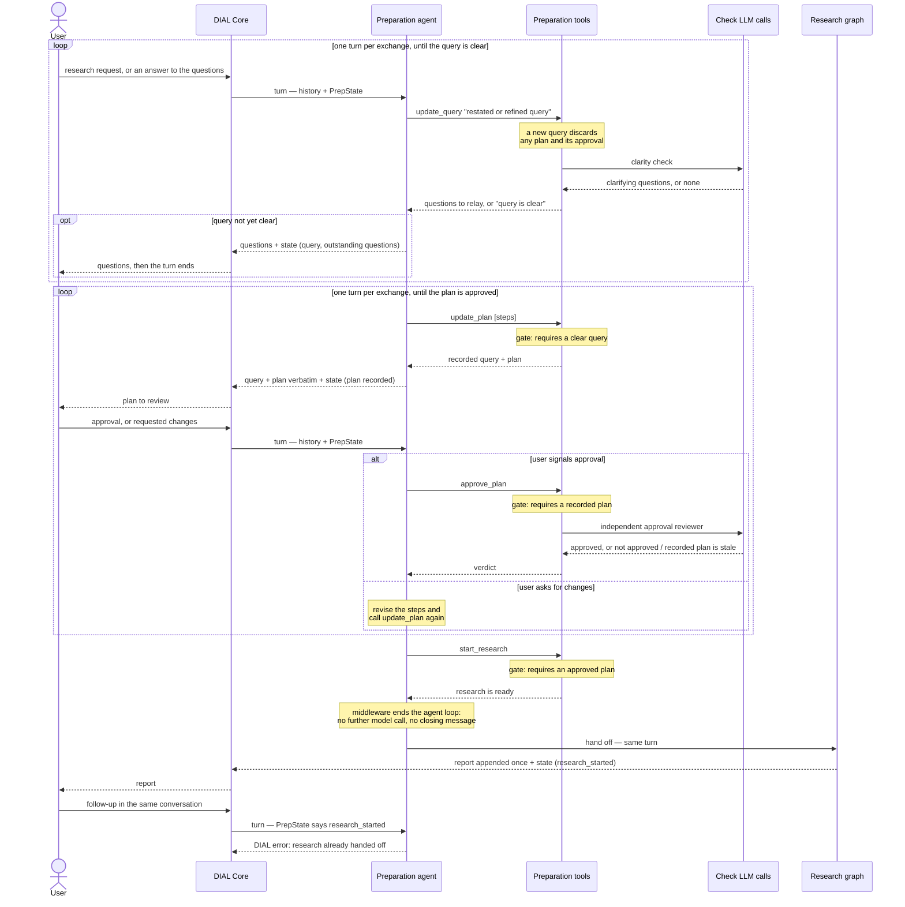
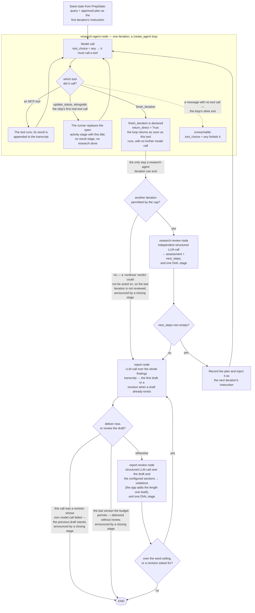

# How Deep Research works

Diagrams of the current runtime flow: the preparation flow, which spans several turns, and the
research graph, which runs autonomously inside one turn. **Turn** here means a DIAL turn between
the user and the assistant: one chat completion request carrying the user's new message, and the
assistant reply streamed back for it. The app keeps nothing between turns, rebuilding each one from
the request it arrives in.

The [OpenSpec specs](../openspec/specs) are the authority on the behaviour. This page is a map:
each section links the specs that own its requirements and quotes only short excerpts from them, so
when a spec changes the diagram points at the new wording instead of restating stale rules.

- [Preparation flow](#preparation-flow)
- [Research graph](#research-graph)

## Preparation flow

Specs: [clarification-and-plan-alignment](../openspec/specs/clarification-and-plan-alignment/spec.md).
Code: `app/preparation/`, `app/completion.py`, `app/history.py`.

The preparation agent advances a clarify → plan → approve → launch flow by calling tools, and the
ordering is enforced by the tools, not by the agent:

> The flow's ordering SHALL be enforced by tool preconditions (hard gates), not by the agent's
> discretion: research SHALL NOT be startable until the working query's clarifications are resolved
> and the plan is user-approved.

Two of the tools make their own independent structured LLM calls — the clarity check inside
`update_query`, and the approval reviewer inside `approve_plan`. The agent cannot approve its own
plan, nor write the readiness flags: only tool code mutates `PrepState`.

Turns are stateless. Each turn reconstructs the history and `PrepState` from the request and
persists both back into the assistant message's `custom_content.state`; the same property is what
makes a rewind work with no rewind-detection logic.

The final turn is where preparation hands off: `start_research` fires and research runs in the
**same** turn, so preparation and research are persisted together, once, at the end of it
(`app/completion.py`). A later message on the same conversation is refused — see the
research-already-handed-off scenario in
[dial-agent-with-mcp](../openspec/specs/dial-agent-with-mcp/spec.md).

The hand-off is silent, and by control flow rather than by prompt wording: a `before_model`
middleware ends the preparation agent's loop as soon as `PrepState` says research has started, so
no model call follows the gate and nothing announces that research is starting. One case stays
outside that guarantee, knowingly: text the model wrote on the same assistant message that carries
the `start_research` call was already streamed before the tool ran, and DIAL content cannot be
retracted, so such a sentence can still appear ahead of the report.

## Research graph

Specs: [research-execution](../openspec/specs/research-execution/spec.md),
[report-composition](../openspec/specs/report-composition/spec.md) (what the report must look like
and the loop that enforces it),
[dial-agent-with-mcp](../openspec/specs/dial-agent-with-mcp/spec.md) (the research-agent node, MCP
tool loading, stages, error delivery).
Code: `app/research/`.

A deterministic LangGraph with four nodes, where every phase transition is Python over the state,
never a model decision:

> `START → research-agent → (research-review when another iteration may still run, else report —
> the last permitted iteration's findings are not reviewed) → (research-agent when
> research-review returns a non-empty next plan, else report) → (END when this call was a
> revision whose own model call failed, or when the draft is the last version the budget
> permits — it is delivered without review — else report-review) → (report when the draft's
> measured word count exceeds the ceiling or report-review asks for a revision, else END)`

**A research-agent iteration ends only when `finish_iteration` is called.** Two mechanisms give
that guarantee, and together they mean research-agent cannot stop early, cannot write its own
summary, and cannot reach the report without a research-review verdict:

- **Forced tool choice** — every model call is issued with `tool_choice="any"`, so each step calls
  some tool. A message carrying no tool call is what would normally end a `create_agent` loop, so
  that exit is unreachable.
- **`return_direct=True` on `finish_iteration`** — the loop returns as soon as that tool executes,
  with no further model call. The tool is a no-op signal: it ends the iteration and nothing more,
  leaving review-vs-report to the graph.

The spec sentence that owns the rule:

> A research-agent iteration SHALL therefore end **only** when research-agent calls
> `finish_iteration`. That tool SHALL be declared `return_direct=True`, so the agent loop returns
> as soon as it executes, with no further model round-trip.

The rest of the loop, in brief — each item is specified in the linked specs:

- **Research-review**: an independent structured LLM call judging coverage; an empty next plan means
  research is complete. It runs after every iteration except the last one the cap permits — a
  "continue" verdict there could not be acted on, so that call is not made.
- **Iteration cap**: `max_research_iterations` (an application property). The last permitted
  iteration hands its findings straight to the report, unreviewed, so a turn always ends with a
  report; the hand-off is logged.
- **Report node**: the only node whose text becomes assistant content, and it is **appended once**,
  after the review loop settles on the draft to deliver. Nothing is streamed: a draft may still be
  revised and DIAL content is append-only, so no rejected draft ever reaches the user. The same node
  writes the first draft and every revision, branching on whether a draft already exists.
  Research-agent, research-review and report-review output never become assistant content;
  research-agent tool calls surface as timed DIAL stages.
- **Report structure**: `default_report_structure` (an application property) — an ordered list of
  `{name, description, protected, references_section}` sections, Overview → Key Findings →
  Detailed Analysis → Conclusion → References by default. Every section is rendered as a `##`
  heading, and the app checks that itself (see the rules bullet below). A section's `description`
  is the single home for its content rules and is passed verbatim to both the report node and
  report-review. A protected section (Overview and References, by default) may be neither dropped
  nor restyled by anything the user asked for; at least one section must be protected. Both models
  are told which sections are protected as a rule of their own — the marker is never rendered next
  to a section name, which the report node is told to use as the heading. `references_section`
  marks the report's sources listing; only the last section may set it, and a structure may
  declare none.
- **Word ceiling**: `max_report_words` (default 2750). A report's length is the number of
  whitespace-separated tokens left after dropping the inline citations and the references section,
  so the ceiling bounds the report's prose rather than its sourcing — `count_report_words` in
  `app/research/report_length.py` is the one definition. The references section is dropped only
  when the structure declares one and the draft wrote it as a `##` heading under its configured
  name; a renamed, missing, or wrongly-levelled heading is measured with the rest, so a structure
  violation earns no length budget. The count is computed in Python and given to the report node
  as a number, so no model has to count; report-review never sees the count — the app's own length
  rule adds the violation when the count exceeds the ceiling. The ceiling is enforced by
  rewriting, never by truncation: no token cap is placed on the report call, and a shortening
  revision rewrites to fit instead of cutting, so the report ends at a clean boundary. A draft over
  the ceiling forces a revision deterministically, even when report-review approved it.
- **App-checked rules** (`app/research/report_rules.py`): the two report rules the app decides
  itself, over the draft text — the section structure (every configured section present, named
  exactly as configured, in order, as a `##` heading) and the word ceiling. Each rule owns three
  things in one class: the instruction rendered into the report writer's prompt, the check over the
  finished draft, and the wording of the violation a revision acts on, so the writer can never be
  told something different from what its draft is judged against. Their violations are prepended to
  report-review's own, and report-review is told the app checks both — leaving it what needs a
  reader: a padded section, the protected-section rules, the banned annotations, valid Markdown,
  the citation format. Because the structure check passes only when every heading matches the
  configuration, the references section is then found by the length measure by construction; that
  correspondence is covered by tests rather than by a runtime signal.
- **Version budget**: `max_report_versions` (default 3) — at most that many report versions, the
  first draft included, so at most three report calls. The last permitted version is delivered as
  it stands, without another review call: its verdict could not be acted on. A failed
  report-review call or a failed revision is absorbed rather than failing the turn. `1` skips
  report-review entirely.
- **Research-review stage**: each research-review call emits one DIAL stage, titled
  `[RESEARCH REVIEW RESULT]`, carrying the reviewed iteration with the iteration cap, the
  reviewer's assessment, and the next steps as a numbered list — or a line stating that research is
  complete, which is what an empty step list means. Its title names the route the graph then takes,
  `continue` or `report`, taken from the same function the router calls. The assessment and the
  steps are LLM response text, so the matching INFO record carries the step *count* only. A failed
  review call emits no stage: research-review re-raises, so the turn ends and the open activity
  stage closes as failed. An iteration the cap left unreviewed is announced by a stage of its own,
  emitted by the router as it hands over so that it precedes the report's stages: it states that the
  review budget is exhausted and carries the iteration with the cap, without a duration — no call
  was made, so it has no findings and no elapsed time. A cap of one emits nothing — one permitted
  iteration means review is off by configuration, not exhausted, the same rule a version budget of
  one follows.
- **Report stage**: the report step emits one stage in a single case — a revision whose own model
  call failed, where the previous draft is delivered instead. It carries its own
  `[REPORT REVISION FAILED]` prefix, since no review took place, and names the draft that was not
  written, the draft delivered, and the failure kind. No draft text: only the draft the loop settles
  on reaches the response.
- **Report-review stage**: each report-review call emits one DIAL stage, titled
  `[REPORT REVIEW RESULT]`, carrying the draft number,
  the measured word count with the ceiling, and the violations as a list — the review model's
  violations, with the app-measured length violation prepended when the draft exceeds the ceiling.
  The matching INFO record carries the same numbers and only the *count* of violations — their
  text is LLM response content, which the logging content allowlist keeps out of log records at
  any level. A delivery whose draft the budget left unreviewed gets a closing stage and INFO
  record of its own, rendered without any model call, so "review approved the draft" and "the
  budget ran out, violations may remain" stay distinguishable.
- **Activity stage**: one DIAL stage is open at every moment of the research run, titled with what
  is happening right now. The runner opens the first before the graph starts; each later one
  replaces the one before it, which is what closes it — a stage name can only be appended to, never
  rewritten. research-agent sets the title by calling `update_status`, and research-review, report
  and report-review each set it on entry, so no LLM call in the graph runs behind a silent screen.
  The stage carries a title only: no body, no `[TOOL]`-style prefix, and no elapsed time — it ends
  because a new step started, not because the announced work finished, so a duration would claim
  something untrue. Several statuses in one assistant message are joined into one title rather than
  opening a stage that closes an instant later and so reads as a finished step; a status sent
  together with `finish_iteration` is ignored. `update_status` gets no result stage of its own and
  no INFO tool-call event, and its text never enters a log record, being a tool-call argument value.
  The announcements are stripped from the transcripts research-review and the report node receive,
  and kept in the one the app persists.
- **Step budget**: `max_research_graph_steps` (an application property, default 500) is passed as
  LangGraph's `recursion_limit` — the most node executions one graph run may make, counted afresh
  for each nested run. The research-agent node is a compiled graph, so every iteration gets its own
  budget, and that loop is what the budget really limits: the outer graph's length is already fixed
  by its own caps, at `2 × max_research_iterations + 2 × max_report_versions − 2` super-steps —
  24 at the default caps; the same formula gives 20 for a version budget of one, where the single
  report call is never reviewed. A research-agent that never calls `finish_iteration` exhausts the budget
  and the turn fails through the DIAL error protocol rather than returning a half-finished answer. A
  tool *error* does not end an iteration — it comes back as an error `ToolMessage` research-agent
  may retry from.
- **Image budget** (the [image-budget](../openspec/specs/image-budget/spec.md) spec): image-carrying
  tool results over the budget are substituted before each model call, so no request exceeds the
  provider's per-request image limit.
