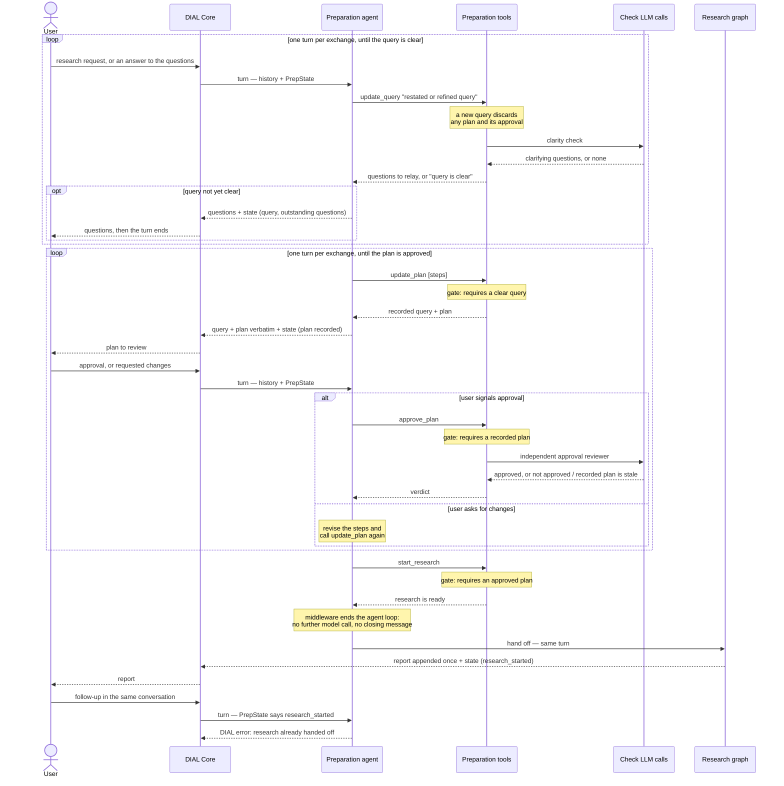
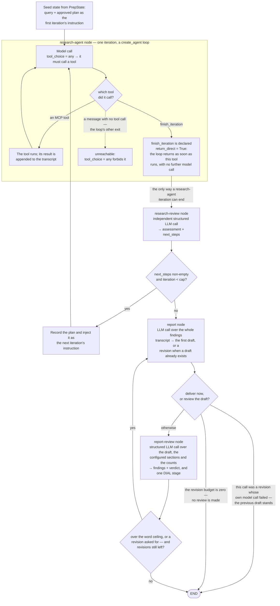

# How Deep Research works

Diagrams of the current runtime flow: the preparation flow, which spans several turns, and the
research graph, which runs autonomously inside one turn. **Turn** here means a DIAL turn between
the user and the assistant: one chat completion request carrying the user's new message, and the
assistant reply streamed back for it. The app keeps nothing between turns, rebuilding each one from
the request it arrives in.

The [OpenSpec specs](../openspec/specs) are the authority on the behaviour. This page is a map:
each section links the specs that own its requirements and quotes only short excerpts from them, so
when a spec changes the diagram points at the new wording instead of restating stale rules.

- [Preparation flow](#preparation-flow)
- [Research graph](#research-graph)

## Preparation flow

Specs: [clarification-and-plan-alignment](../openspec/specs/clarification-and-plan-alignment/spec.md).
Code: `app/preparation/`, `app/completion.py`, `app/history.py`.

The preparation agent advances a clarify → plan → approve → launch flow by calling tools, and the
ordering is enforced by the tools, not by the agent:

> The flow's ordering SHALL be enforced by tool preconditions (hard gates), not by the agent's
> discretion: research SHALL NOT be startable until the working query's clarifications are resolved
> and the plan is user-approved.

Two of the tools make their own independent structured LLM calls — the clarity check inside
`update_query`, and the approval reviewer inside `approve_plan`. The agent cannot approve its own
plan, nor write the readiness flags: only tool code mutates `PrepState`.

Turns are stateless. Each turn reconstructs the history and `PrepState` from the request and
persists both back into the assistant message's `custom_content.state`; the same property is what
makes a rewind work with no rewind-detection logic.

The final turn is where preparation hands off: `start_research` fires and research runs in the
**same** turn, so preparation and research are persisted together, once, at the end of it
(`app/completion.py`). A later message on the same conversation is refused — see the
research-already-handed-off scenario in
[dial-agent-with-mcp](../openspec/specs/dial-agent-with-mcp/spec.md).

The hand-off is silent, and by control flow rather than by prompt wording: a `before_model`
middleware ends the preparation agent's loop as soon as `PrepState` says research has started, so
no model call follows the gate and nothing announces that research is starting. One case stays
outside that guarantee, knowingly: text the model wrote on the same assistant message that carries
the `start_research` call was already streamed before the tool ran, and DIAL content cannot be
retracted, so such a sentence can still appear ahead of the report.

## Research graph

Specs: [research-execution](../openspec/specs/research-execution/spec.md),
[report-composition](../openspec/specs/report-composition/spec.md) (what the report must look like
and the loop that enforces it),
[dial-agent-with-mcp](../openspec/specs/dial-agent-with-mcp/spec.md) (the research-agent node, MCP
tool loading, stages, error delivery).
Code: `app/research/`.

A deterministic LangGraph with four nodes, where every phase transition is Python over the state,
never a model decision:

> `START → research-agent → research-review → (research-agent when research-review returns a
> non-empty next plan and the iteration cap is not yet reached, else report) → (END when this call
> was a revision whose own model call failed, else report-review when the revision budget is
> non-zero, else END) → (report when the draft's measured word count exceeds the ceiling or
> report-review asks for a revision, and the revision budget allows, else END)`

**A research-agent iteration ends only when `finish_iteration` is called.** Two mechanisms give
that guarantee, and together they mean research-agent cannot stop early, cannot write its own
summary, and cannot reach the report without a research-review verdict:

- **Forced tool choice** — every model call is issued with `tool_choice="any"`, so each step calls
  some tool. A message carrying no tool call is what would normally end a `create_agent` loop, so
  that exit is unreachable.
- **`return_direct=True` on `finish_iteration`** — the loop returns as soon as that tool executes,
  with no further model call. The tool is a no-op signal: it ends the iteration and nothing more,
  leaving review-vs-report to the graph.

The spec sentence that owns the rule:

> A research-agent iteration SHALL therefore end **only** when research-agent calls
> `finish_iteration`. That tool SHALL be declared `return_direct=True`, so the agent loop returns
> as soon as it executes, with no further model round-trip.

The rest of the loop, in brief — each item is specified in the linked specs:

- **Research-review**: an independent structured LLM call judging coverage; an empty next plan means
  research is complete. It cannot be skipped — review always precedes the report.
- **Iteration cap**: `max_research_iterations` (an application property). Reaching it routes to the
  report regardless of research-review's verdict, so a turn always ends with a report.
- **Report node**: the only node whose text becomes assistant content, and it is **appended once**,
  after the review loop settles on the draft to deliver. Nothing is streamed: a draft may still be
  revised and DIAL content is append-only, so no rejected draft ever reaches the user. The same node
  writes the first draft and every revision, branching on whether a draft already exists.
  Research-agent, research-review and report-review output never become assistant content;
  research-agent tool calls surface as timed DIAL stages.
- **Section structure**: `default_report_structure` (an application property) — an ordered list of
  `{name, description, protected}` sections, Key Findings → Detailed Analysis → Conclusion →
  References by default. A section's `description` is the single home for its content rules and is
  passed verbatim to both the report node and report-review. A protected section (References, by
  default) may be neither dropped nor restyled by anything the user asked for; at least one section
  must be protected.
- **Word ceiling**: `max_report_words` (default 2750). A length is the number of
  whitespace-separated tokens in the report Markdown, counted in Python and given to the report
  node and to report-review as a number, so neither has to count. It is enforced by reviewing and
  rewriting, never by truncation: no token cap is placed on the report call, and a shortening
  revision rewrites to fit instead of cutting, so the report ends at a clean boundary. A draft over
  the ceiling forces a revision deterministically, even when report-review approved it.
- **Revision budget**: `max_report_revisions` (default 2) — at most that many revisions, so at most
  three report calls. When it runs out the latest draft is delivered as it stands; a failed
  report-review call or a failed revision is absorbed rather than failing the turn. `0` skips
  report-review entirely.
- **Report-review stage**: each report-review call emits one DIAL stage carrying the draft number,
  the measured word count with the ceiling, and the findings as a list. The matching INFO record
  carries the same numbers and only the *count* of findings — findings are LLM response text, which
  the logging content allowlist keeps out of log records at any level. Research review emits no
  stage.
- **Step budget**: `max_research_graph_steps` (an application property, default 500) is passed as
  LangGraph's `recursion_limit` — the most node executions one graph run may make, counted afresh
  for each nested run. The research-agent node is a compiled graph, so every iteration gets its own
  budget, and that loop is what the budget really limits: the outer graph's length is already fixed
  by its own caps, at `2 × max_research_iterations + 2 × (max_report_revisions + 1)` super-steps —
  26 at the default caps, and `2 × max_research_iterations + 1` (21) when the revision budget is
  zero and no review runs. A research-agent that never calls `finish_iteration` exhausts the budget
  and the turn fails through the DIAL error protocol rather than returning a half-finished answer. A
  tool *error* does not end an iteration — it comes back as an error `ToolMessage` research-agent
  may retry from.
- **Image budget** (the [image-budget](../openspec/specs/image-budget/spec.md) spec): image-carrying
  tool results over the budget are substituted before each model call, so no request exceeds the
  provider's per-request image limit.
